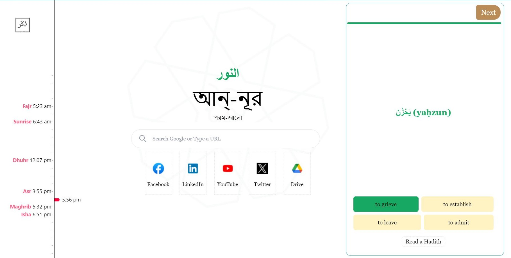

<h2 dir="rtl" align="center">
بِسْمِ اللَّهِ الرَّحْمَنِ الرَّحِيم
</h2>

# Dhikr Browser Extension

<div dir="rtl" align="center"> <font size="+1">
فَٱذْكُرُونِىٓ أَذْكُرْكُمْ وَٱشْكُرُواْ لِى وَلَا تَكْفُرُونِ
</font>
</div>

<div align="center">
So remember Me and I shall remember you; give thanks to Me and do not be ungrateful to Me for My favours. (2:152)
</div>

## Overview

Dhikr is a cross-browser extension that brings a touch of spiritual enrichment to your daily browsing experience. With Dhikr, every new tab becomes an opportunity to read a Hadith and learn a new word, fostering a sense of mindfulness and knowledge.




## Features

- **Hadith:** Each time you open a new tab, Dhikr presents you with a carefully selected Hadith to inspire and guide you.

- **Learn a New Word:** Expand your vocabulary by discovering a new word with its definition every time you open a new tab.

- **Cross Browser Support:** Dhikr is available for both Chrome and Firefox browsers, ensuring accessibility for a wider audience.

## Installation
### Chrome
- Visit the [Chrome Web Store](https://chromewebstore.google.com/detail/dhikr-browser-extension/alhhipkdolifadffnollpkijfpnlnfka).
- Click on "Add to Chrome" to install the extension.
- Dhikr is now ready to enrich your browsing experience.
### Firefox
- Visit the [Firefox Add-ons](https://addons.mozilla.org/en-US/firefox/addon/dhikr/).
- Click on "Add to Firefox" to install the extension.
- Dhikr is now ready to enhance your Firefox browsing.

## Development
To set up the development environment for Dhikr, follow these steps:

1. Clone the repository:
```bash
git clone https://github.com/Balagha/dhikr.git
```
2. Install dependencies:
```bash
cd dhikr
npm install
```
3. Create a .env file in the root directory and set the necessary environment variables.

4. Start the development server:
```bash
npm start
```

## Build

To build Dhikr for Chrome or Firefox, use the following commands:

### Chrome
```bash
npm run build:chrome
```

### Firefox
```bash
npm run build:firefox
```
These commands will generate the necessary build files in the build directory.

## Contributing
We welcome contributions from the community. If you find any issues or have ideas for improvements, please open an issue or submit a pull request.

## License
This project is licensed under the [Apache License](https://github.com/Balagha/dhikr/blob/main/LICENSE).

<hr/>
